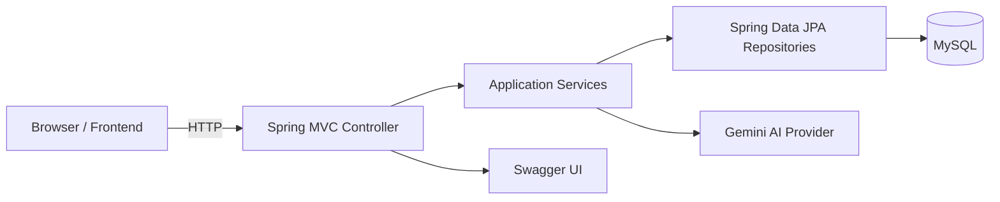

# Architecture Overview

## Responsibilities
- Controllers expose the REST API and map DTOs to service calls.
- Services implement business logic, version creation, and AI analysis orchestration.
- Repositories store submissions and version history.
- Configuration and filters handle security, logging, validation, and rate limiting.
